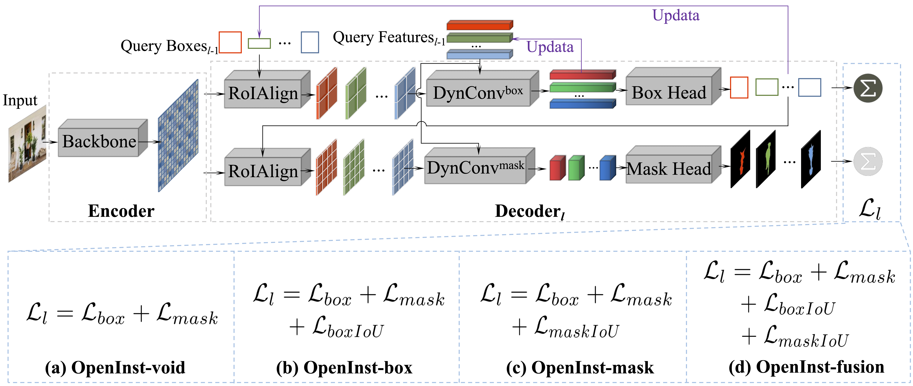

# OpenInst
> [**OpenInst: A Simple Query-Based Method for Open-World Instance Segmentation**](https://arxiv.org/abs/2303.15859)
> 
> Cheng Wang, Guoli Wang, Qian Zhang, Peng Guo, Wenyu Liu, Xinggang Wang
> 
> *[arXiv 2303.15859](https://arxiv.org/abs/2303.15859)*

## Abstract
Open-world instance segmentation has recently gained significant popularity due to its importance in many real-world applications, such as autonomous driving, robot perception, and remote sensing. However, previous methods have either produced unsatisfactory results or relied on complex systems and paradigms. We wonder if there is a simple way to obtain state-of-the-art results. Fortunately, we have identified two observations that help us achieve the best of both worlds: 1) query-based methods demonstrate superiority over dense proposal-based methods in open-world instance segmentation, and 2) learning localization cues is sufficient for open-world instance segmentation. Based on these observations, we propose a simple query-based method named OpenInst for open-world instance segmentation. OpenInst leverages advanced query-based methods like QueryInst and focuses on learning localization cues. Notably, OpenInst is an extremely simple and straightforward framework without any auxiliary modules or post-processing, yet achieves state-of-the-art results on multiple benchmarks. Specifically, in the COCO->UVO scenario, OpenInst achieves a mask Average Recall (AR) of 53.3, outperforming the previous best methods by 2.0 AR with a simpler structure. We hope that OpenInst can serve as a solid baseline for future research in this area.

<p align="center"></p> 

## Cross-dataset instance segmentation performance
### Results on COCO->UVO
| Method     | Epoch | AR<sup>box | AR<sub>0.75 | AR<sub>0.5 | AR<sub>s | AR<sub>m | AR<sub>l |
|------------|--|------|------|------|------|-------|-------|
| OpenInst   | 12 | 59.1 | 48.7 | 72.6 | 51.4 | 26.4 | 44.3 | 60.4 |
| OpenInst   | 36 | 63.0 | 53.3 | 76.6 | 56.8 | 31.8 | 49.4 | 64.3 |


| Method     | Epoch | AR<sup>box | AR<sub>0.75 | AR<sub>0.5 | AR<sub>s | AR<sub>m | AR<sub>l |
|------------|--|------|------|------|------|-------|-------|
OpenInst-void   | 12 | 58.4          | 48.5          | 71.3          | 51.3          | 25.1             | 43.7           | 60.8 |
OpenInst-cls    | 12 | 55.7          | 44.9          | 72.1          | 46.7          | 24.0             | 41.8           | 55.2 |
OpenInst-box    | 12 | 59.1          | 48.7          | 72.6          | 51.4          | 26.4             | 44.3           | 60.4 |
OpenInst-mask   | 12 | 58.1          | 47.8          | 71.2          | 50.6          | 24.4             | 43.3           | 60.1 |
OpenInst-fusion | 12 | 58.6          | 48.1          | 72.0          | 50.8          | 25.6             | 43.9           | 59.8 |


## Training
You need to change the **ann_file** and **img_prefix** in [coco_to_uvo_ins.py](https://github.com/hustvl/OpenInst/blob/main/configs/openinst/coco_to_uvo_ins.py), and then run as follows：
```
# training on COCO train set,  evaluate on UVO val set.
sh tools/dist_train.sh configs/openinst/coco_to_uvo_ins.py 8
```
## Testing
```
sh tools/dist_train.sh configs/openinst/coco_to_uvo_ins.py /path/to/model 8
```

## Citation
If you find OpenInst useful in your research or applications, please consider giving us a star 🌟 and citing it using the following BibTeX entry.
```bibtex
@article{wang2023openinst,
      title={OpenInst: A Simple Query-Based Method for Open-World Instance Segmentation}, 
      author={Cheng Wang and Guoli Wang and Qian Zhang and Peng Guo and Wenyu Liu and Xinggang Wang},
      year={2023},
      eprint={2303.15859},
      archivePrefix={arXiv},
      primaryClass={cs.CV}
}
```

## Acknowledgements
A large part of the code is borrowed from [OLN](https://github.com/mcahny/object_localization_network), [QueryInst](https://github.com/hustvl/QueryInst), and [MMDetection](https://github.com/open-mmlab/mmdetection). 
Thanks for their great works.
